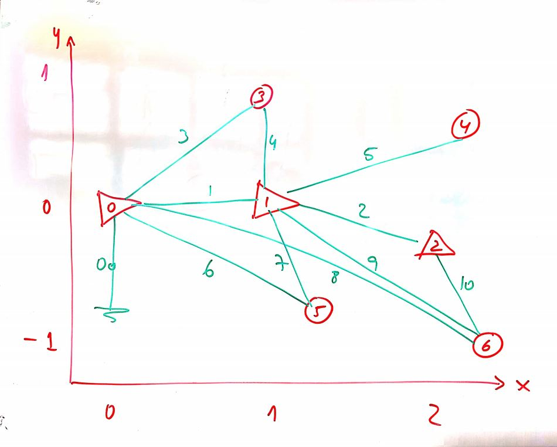
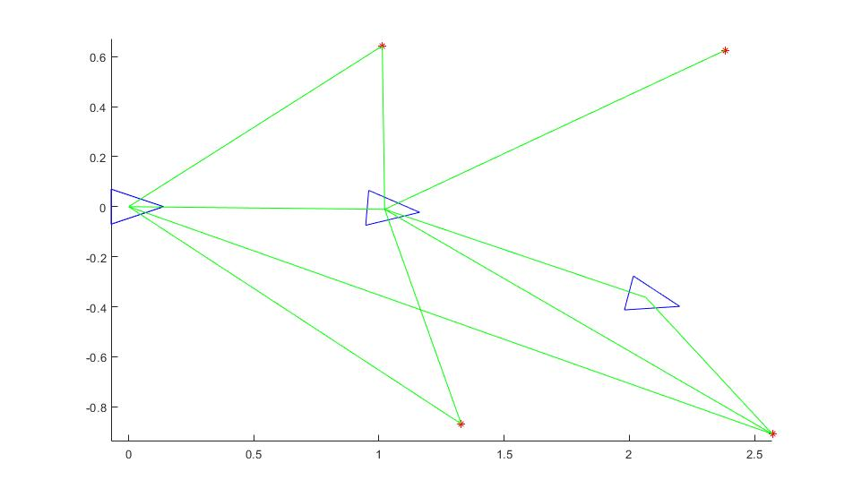
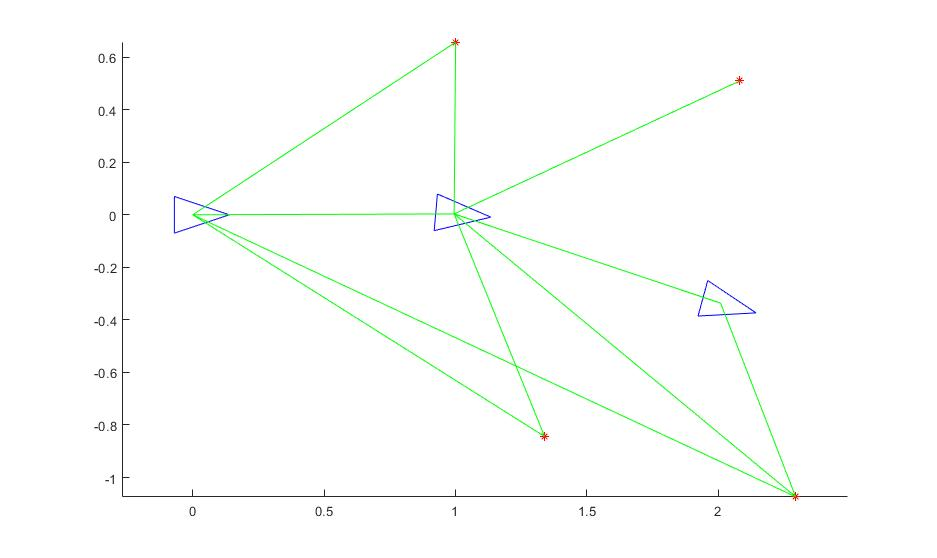

# SLAM_MatlabProject

## Exercici SLAM en Matlab de l'assignatura de Robòtica Terrestre del Màster de Robòtica d'Eurecat

L'script "SlamScript" utilitza totes les funcions proporcionades per a tal de recrear el mapa proporcionat.

Imatge proporcionada:

Solució aconseguida:

Proposta de millora:

Solució millorada:

